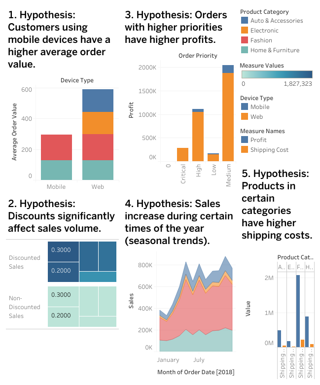
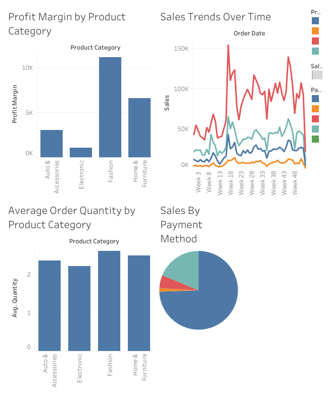
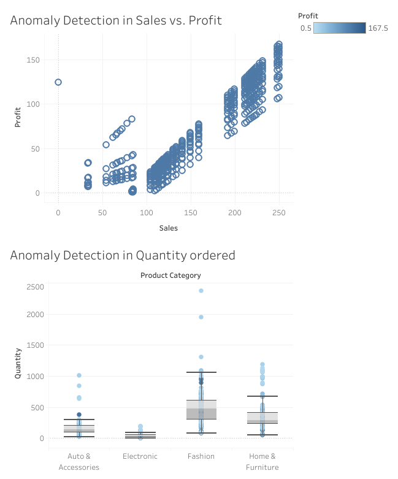

# E-Commerce Data Analysis Project

## Introduction
This project involves analyzing an e-commerce dataset to extract meaningful insights. The project includes data collection, data cleaning, exploratory data analysis (EDA), visualizations, hypothesis testing, and anomaly detection.

## Tools Used
- **SQLite in DBeaver:** For database management and SQL queries.
- **Python:** For data preprocessing and correlation matrix calculation.
- **Tableau:** For visualizing the data and creating dashboards.

## Steps Involved
1. Data Collection
2. Data Cleaning
3. Exploratory Data Analysis (EDA)
4. Data Visualization
5. Hypothesis Testing
6. Anomaly Detection

## Data Collection

The data was collected from kaggle: "https://www.kaggle.com/datasets/mervemenekse/ecommerce-dataset/data#".

 The dataset includes information about customer orders, product details, sales transactions etc.

**CSV File:** `E-commerce_Dataset.csv`

## Data Cleaning

Data cleaning was performed using Python and SQLite in DBeaver. The steps involved handling missing values, removing duplicates, and normalizing the data.

### Steps:

1. 
    ```python
    import pandas as pd
    file_path = 'E-commerce_Dataset.csv'
    df = pd.read_csv(file_path)
    ```

2. 
    ```python
    df.fillna(0, inplace=True)
    ```

3. 
    ```python
    df.drop_duplicates(inplace=True)
    ```


4. **Import cleaned data into SQLite using DBeaver.**

## Exploratory Data Analysis (EDA)

EDA was performed to understand user behavior patterns using Python and visualized in Tableau.


### Visualizations in Tableau

1. **Hypothesis Testing:**
      [View the Tableau Dashboard](https://public.tableau.com/app/profile/giorgi.gogitidze/viz/HypothesisTesting_17200713809870/Hypothesis)
      
   
2. **Sales and Profit Analysis:** 
      [View the Tableau Dashboard](https://public.tableau.com/app/profile/giorgi.gogitidze/viz/SalesandProfitAnalysis_17200713244600/SalesandProfitAnalysis)
      

3. **Anomaly Testing:**
      [View the Tableau Dashboard](https://public.tableau.com/app/profile/giorgi.gogitidze/viz/AnomalyDetection_17200714394430/AnomalyDetection)
      


## Hypothesis Testing

Hypotheses were tested using formal statistical practices, including null and alternative hypotheses, and steps for testing these hypotheses using Python for statistical analysis and Tableau for visualization.


### 1. Hypothesis: Customers using mobile devices have a higher average order value.

- **Null Hypothesis (H0):** The average order value for customers using mobile devices is equal to the average order value for customers using web devices.
- **Alternative Hypothesis (H1):** The average order value for customers using mobile devices is not equal to the average order value for customers using web devices.

**Steps:**

1. **Calculate Average Order Value by Device Type:**
    ```python
    import pandas as pd
    from scipy import stats

    # Load dataset
    df = pd.read_csv('Cleaned_E_commerce_Dataset_v1.csv')

    # Group by Device_Type and calculate the mean Sales
    mobile_sales = df[df['Device_Type'] == 'Mobile']['Sales']
    web_sales = df[df['Device_Type'] == 'Web']['Sales']

    # Perform t-test
    t_stat, p_value = stats.ttest_ind(mobile_sales, web_sales)
    print(f"T-statistic: {t_stat}, P-value: {p_value}")
    ```

2. **Interpret Results:**
    - If the p-value is less than the significance level (e.g., 0.05), reject the null hypothesis.

3. **Visualize in Tableau:**
    - Create a bar chart showing average order values for mobile vs. web.

### 2. Hypothesis: Discounts significantly affect sales volume.

- **Null Hypothesis (H0):** Discounts do not affect sales volume.
- **Alternative Hypothesis (H1):** Discounts affect sales volume.

**Steps:**

1. **Create Calculated Fields:**
    ```python
    import pandas as pd
    from scipy import stats

   
    df = pd.read_csv('Cleaned_E_commerce_Dataset_v1.csv')

    
    discounted_sales = df[df['Discount'] > 0]['Sales']
    non_discounted_sales = df[df['Discount'] == 0]['Sales']

    # t-test
    t_stat, p_value = stats.ttest_ind(discounted_sales, non_discounted_sales)
    print(f"T-statistic: {t_stat}, P-value: {p_value}")
    ```

2. **Interpret Results:**
    - If the p-value is less than the significance level (e.g., 0.05), reject the null hypothesis.

3. **Visualize in Tableau:**
    - Create a bar chart comparing total sales of discounted vs. non-discounted products.

### 3. Hypothesis: Orders with higher priorities have higher profits.

- **Null Hypothesis (H0):** Order priority does not affect profits.
- **Alternative Hypothesis (H1):** Orders with higher priorities have higher profits.

**Steps:**

1. **Calculate Profit by Order Priority:**
    ```python
    import pandas as pd
    from scipy import stats

    
    df = pd.read_csv('Cleaned_E_commerce_Dataset_v1.csv')

    # ANOVA test
    f_stat, p_value = stats.f_oneway(df[df['Order_Priority'] == 'Critical']['Profit'],
                                     df[df['Order_Priority'] == 'High']['Profit'],
                                     df[df['Order_Priority'] == 'Medium']['Profit'],
                                     df[df['Order_Priority'] == 'Low']['Profit'])
    print(f"F-statistic: {f_stat}, P-value: {p_value}")
    ```

2. **Interpret Results:**
    - If the p-value is less than the significance level (e.g., 0.05), reject the null hypothesis.

3. **Visualize in Tableau:**
    - Create a bar chart showing profits for different order priorities.

### 4. Hypothesis: Sales increase during certain times of the year (seasonal trends).

- **Null Hypothesis (H0):** There is no seasonal trend in sales.
- **Alternative Hypothesis (H1):** Sales increase during certain times of the year.

**Steps:**

1. **Calculate Sales by Month:**
    ```python
    import pandas as pd
    from scipy import stats

    
    df = pd.read_csv('Cleaned_E_commerce_Dataset_v1.csv')
    df['Order_Date'] = pd.to_datetime(df['Order_Date'])
    df['Month'] = df['Order_Date'].dt.month

    # ANOVA test
    f_stat, p_value = stats.f_oneway(df[df['Month'] == 1]['Sales'],
                                     df[df['Month'] == 2]['Sales'],
                                     df[df['Month'] == 3]['Sales'],
                                     df[df['Month'] == 4]['Sales'],
                                     df[df['Month'] == 5]['Sales'],
                                     df[df['Month'] == 6]['Sales'],
                                     df[df['Month'] == 7]['Sales'],
                                     df[df['Month'] == 8]['Sales'],
                                     df[df['Month'] == 9]['Sales'],
                                     df[df['Month'] == 10]['Sales'],
                                     df[df['Month'] == 11]['Sales'],
                                     df[df['Month'] == 12]['Sales'])
    print(f"F-statistic: {f_stat}, P-value: {p_value}")
    ```

2. **Interpret Results:**
    - If the p-value is less than the significance level (e.g., 0.05), reject the null hypothesis.

3. **Visualize in Tableau:**
    - Create a line chart showing sales trends over time.

### 5. Hypothesis: Products in certain categories have higher shipping costs.

- **Null Hypothesis (H0):** Product category does not affect shipping costs.
- **Alternative Hypothesis (H1):** Products in certain categories have higher shipping costs.

**Steps:**

1. **Calculate Shipping Cost by Product Category:**
    ```python
    import pandas as pd
    from scipy import stats

   
    df = pd.read_csv('Cleaned_E_commerce_Dataset_v1.csv')

    # ANOVA test
    f_stat, p_value = stats.f_oneway(df[df['Product_Category'] == 'Auto & Accessories']['Shipping_Cost'],
                                     df[df['Product_Category'] == 'Electronic']['Shipping_Cost'],
                                     df[df['Product_Category'] == 'Fashion']['Shipping_Cost'],
                                     df[df['Product_Category'] == 'Home & Furniture']['Shipping_Cost'])
    print(f"F-statistic: {f_stat}, P-value: {p_value}")
    ```

2. **Interpret Results:**
    - If the p-value is less than the significance level (e.g., 0.05), reject the null hypothesis.

3. **Visualize in Tableau:**
    - Create a bar chart comparing shipping costs across different product categories.


## Anomaly Detection

Anomaly detection was performed to identify outliers in the data.

1. **Anomaly Detection in Sales vs. Profit:**
    - Scatter plot to identify outliers where profit is unusually high or low for given sales.

2. **Anomaly Detection in Quantity Ordered:**
    - Box plot to identify outliers in order quantities across different product categories.
